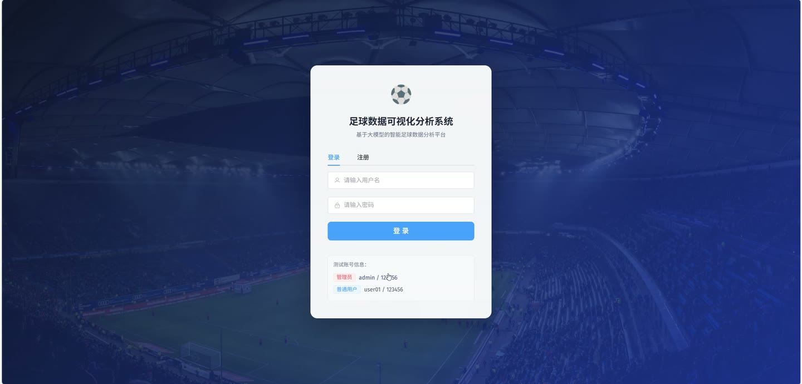
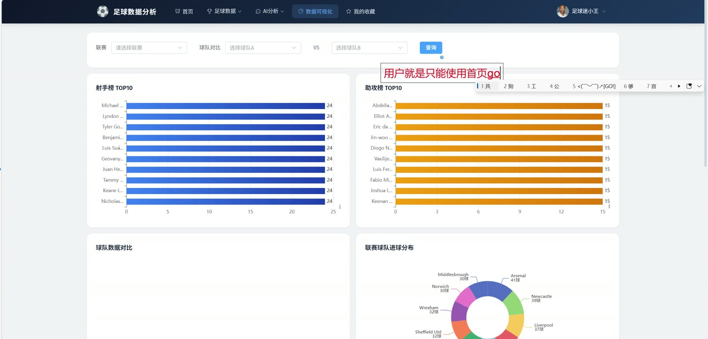
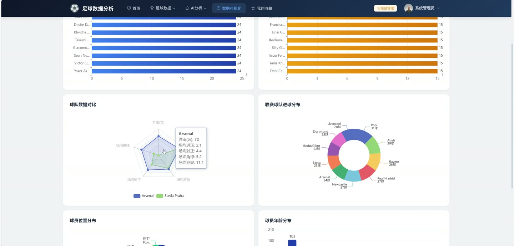
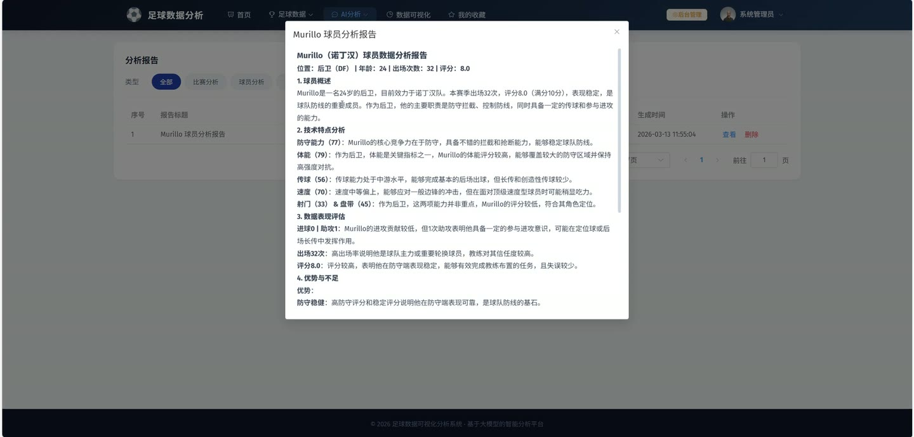
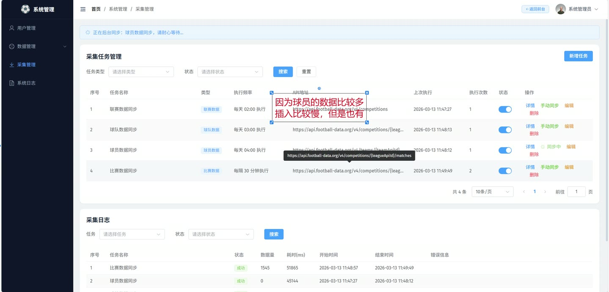
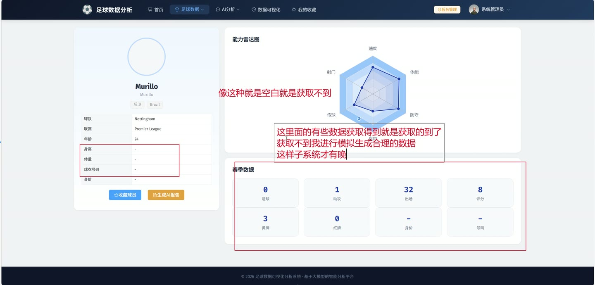

# (附文档)Springboot3+Vue3+MySQL 基于大模型的足球数据可视化分析系统

**技术栈**：Springboot3、Vue3、MySQL

### 系统简介

本系统是一套基于 SpringBoot3 + Vue3 前后端分离架构的足球数据可视化分析平台，集成文心大模型（ERNIE-4.0-Turbo）实现智能问答与自动分析报告生成。系统支持普通用户与管理员双角色，覆盖联赛、球队、球员、比赛等核心足球实体的数据管理，并提供数据采集、AI 对话、分析报告、收藏、文件上传等完整业务功能。
 
### 核心功能
 
### 普通用户端

 
- 用户注册与登录：通过用户名密码完成注册/登录，登录后返回 token 用于后续请求鉴权 
- 个人信息管理：查看当前用户信息、修改个人资料（昵称、邮箱等）、修改密码（需验证旧密码） 
- AI 智能问答：输入足球相关问题，系统调用文心大模型返回专业回答，支持多轮对话上下文 
- 对话历史查看：按 sessionId 查看历史对话记录列表，支持分页查询 
- 分析报告生成：对指定比赛、球员或球队一键生成 AI 分析报告（异步生成，状态为 generating 时等待完成） 
- 分析报告管理：分页查看个人生成的报告列表（可按报告类型筛选）、查看报告详情、删除报告 
- 联赛数据浏览：分页查看联赛列表（支持按名称/国家筛选）、查看联赛详情、获取所有联赛下拉列表 
- 球队数据浏览：分页查看球队列表（支持按名称/联赛筛选）、查看球队详情（含联赛名称）、按联赛获取球队下拉列表 
- 球员数据浏览：分页查看球员列表（支持按姓名/球队/位置筛选）、查看球员详情（含球队与联赛名称）、按球队获取球员列表 
- 比赛数据浏览：分页查看比赛列表（支持按联赛/球队/状态/日期范围筛选）、查看比赛详情（含比赛事件）、最近比赛列表 
- 球队对阵统计：查询两支球队的历史对阵统计（胜平负次数、进球数等） 
- 射手榜与助攻榜：查看指定联赛的射手榜/助攻榜（支持设置返回条数） 
- 收藏功能：对比赛、球员、球队添加/取消收藏、查看收藏列表（可按类型筛选）、检查是否已收藏 
- 文件上传：上传通用文件或图片，支持删除已上传文件
 
### 管理员端

 
- 用户管理：分页查询用户列表（支持按用户名/角色/状态筛选）、查看用户详情、修改用户信息、删除用户 
- 用户状态管理：启用/禁用用户账号（修改 status 字段） 
- 密码重置：将指定用户的密码重置为默认密码（123456）或自定义密码 
- 数据采集任务管理：新增/修改/删除采集任务、分页查询任务列表（支持按任务类型/状态筛选） 
- 手动触发数据同步：对指定采集任务手动触发异步同步（支持联赛/球队/球员/比赛四种类型） 
- 同步状态监控：查询指定任务是否正在同步中 
- 采集日志查看：分页查询采集日志（支持按任务ID/状态筛选），查看每次同步的数据量、耗时与错误信息 
- 系统操作日志：分页查询系统操作日志（支持按用户名/操作类型/状态筛选）、删除单条日志、批量删除日志 
- 联赛管理：新增/修改/删除联赛 
- 球队管理：新增/修改/删除球队 
- 球员管理：新增/修改/删除球员 
- 比赛管理：新增/修改/删除比赛 
- 分析报告管理：查看所有用户的报告列表，删除任意报告 
- AI 对话记录管理：分页查询所有用户的对话记录
 
### 技术栈

 后端框架Spring Boot 3.x ORMMyBatis-Plus 权限JWT Token 鉴权（@RequestAttribute Long userId 获取当前用户） 前端框架Vue 3 状态管理Pinia 构建工具Vite 数据库MySQL AI 大模型文心大模型 ERNIE-4.0-Turbo（Bearer Token 鉴权） HTTP 客户端OkHttp JSON 处理FastJSON / HuTool 数据采集 APIFootball-Data.org API 文件存储本地文件系统（SysFile 表管理）
 
### 交付内容

 
- 后端完整源码 
- 前端完整源码 
- 数据库初始化脚本 
- 万字文档

## 界面展示

---

## 获取完整源码 + 万字文档

本仓库为项目介绍页。**完整前后端源码、数据库初始化脚本、万字项目文档**，请加微信 `kangkangcode`，或访问 [codekk.top](http://codekk.top) 获取。

可作课程设计 / 毕业设计参考，支持远程部署调试。